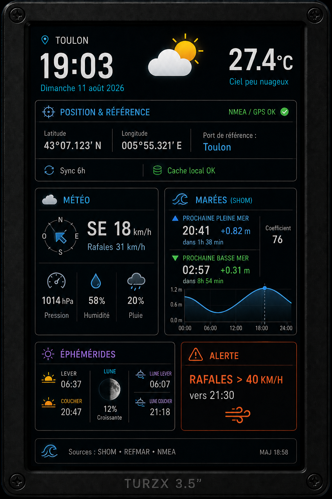

# Marine Dashboard SHOM

Projet Python de tableau de bord maritime léger destiné à l'affichage d'informations de navigation, de marée et de météo sur un petit écran embarqué, notamment de type **TURZX 3,5 pouces**.

L'objectif est de transformer un écran initialement destiné à la télémétrie PC en véritable petit afficheur maritime autonome, utilisable à bord d'un voilier, d'un bateau de plaisance ou d'une petite unité de pêche.



---

## Objectif du projet

Le projet doit à terme pouvoir afficher notamment :

* la position GPS ;
* le port ou point de prédiction SHOM le plus pertinent ;
* la hauteur d'eau actuelle ;
* la tendance de marée ;
* les prochaines pleines et basses mers ;
* les coefficients lorsqu'ils sont disponibles ;
* les éphémérides ;
* la météo locale ;
* les alertes météo ou maritimes utiles ;
* l'état des données locales et de leur dernière synchronisation.

L'application est pensée pour fonctionner avec une connexion Internet limitée.

Les données externes doivent être téléchargées périodiquement, stockées localement puis exploitées hors ligne.

L'objectif envisagé est une synchronisation environ toutes les **6 heures**, soit quatre fois par jour.

---

# Architecture générale

Le projet est volontairement découpé en plusieurs couches.

```text
GPS / NMEA
    │
    ▼
PositionService
    │
    ▼
StationService
    │
    ├── Catalogue local
    │
    └── SHOM / SAPM
            │
            ▼
      PredictionTarget
            │
            ▼
        Providers
            │
     ┌──────┴───────┐
     │              │
    SHOM          Météo
     │
     ▼
   SQLite
     │
     ▼
  Services
     │
     ├── TideService
     ├── WeatherService
     ├── EphemerisService
     ├── TrendService
     └── AlertService
            │
            ▼
        Renderer
            │
            ▼
      écran TURZX
```

Le principe important est que l'écran n'accède jamais directement aux API.

Il ne fait qu'afficher des données déjà préparées par les différentes couches du programme.

---

# Structure actuelle

```text
marine_dashboard/
│
├── main.py
├── config.yaml
├── requirements.txt
├── README.md
│
├── app/
│   ├── controller.py
│   └── scheduler.py
│
├── config/
│   ├── settings.py
│   └── ports.json
│
├── positioning/
│   ├── nmea_reader.py
│   ├── gps.py
│   ├── manual_position.py
│   ├── nearest_station.py
│   └── serial_reader.py
│
├── providers/
│   ├── base_provider.py
│   ├── shom.py
│   ├── shom_parser.py
│   ├── refmar.py
│   └── weather.py
│
├── database/
│   ├── database.py
│   ├── schema.py
│   └── cleanup.py
│
├── models/
│   ├── position.py
│   ├── tide.py
│   ├── weather.py
│   ├── ephemeris.py
│   ├── alert.py
│   └── prediction_target.py
│
├── services/
│   ├── position_service.py
│   ├── station_service.py
│   ├── tide_service.py
│   ├── weather_service.py
│   ├── ephemeris_service.py
│   ├── trend_service.py
│   └── alert_service.py
│
├── display/
│   ├── turzx.py
│   ├── renderer.py
│   ├── screens.py
│   └── widgets/
│
├── tools/
│   ├── test_shom_live.py
│   └── test_shom_auth.py
│
├── assets/
├── data/
├── logs/
└── tests/
```

---

# Fonctionnalités actuellement développées

## Position GPS / NMEA

Un premier moteur de positionnement est fonctionnel.

Il sait lire des trames :

```text
$GPRMC
$GNRMC
```

et en extraire :

* latitude ;
* longitude ;
* date et heure UTC ;
* vitesse en nœuds ;
* route fond.

Le checksum NMEA est vérifié avant exploitation.

Une lecture série est également disponible via `pyserial`.

---

## Gestion des positions de secours

`PositionService` utilise l'ordre de priorité suivant :

```text
1. GPS / NMEA actif
2. dernière position valide en cache
3. position manuelle
4. erreur contrôlée
```

Une ancienne position GPS peut donc continuer à être utilisée pendant une durée définie lorsque la réception est temporairement perdue.

---

## Recherche du point maritime pertinent

Le projet dispose d'un calcul de distance basé sur la formule de Haversine.

Il peut ainsi déterminer la station locale la plus proche d'une position.

La sélection actuelle suit cette logique :

```text
Position
   │
   ▼
StationService
   │
   ├── station imposée manuellement
   │
   ├── SAPM si disponible
   │
   └── catalogue local
```

Une distinction est conservée entre :

* un port SHOM ;
* un point du modèle de prédiction SHOM.

---

# Intégration SHOM

L'intégration SHOM constitue actuellement la partie la plus avancée du projet.

## Liste publique des ports

Le service public :

```text
/spm/listHarbors
```

est intégré.

Un test réel effectué le 11 août 2026 a permis de récupérer :

```text
388 ports / sites
```

Le parser récupère notamment :

* identifiant CST ;
* nom ;
* pays ;
* fuseau horaire ;
* fuseaux supplémentaires ;
* disponibilité des coefficients ;
* caractère officiel ou non du site.

---

## SAPM

Le projet contient également la structure nécessaire au service SAPM.

Les réponses de recherche de localités peuvent être transformées en :

```python
ShomNearbyHarbor
```

ou :

```python
ShomModelPoint
```

Ces objets sont ensuite convertis en cible de prédiction commune :

```python
PredictionTarget
```

---

# Authentification SHOM

Les appels authentifiés utilisent :

* une clé d'abonnement ;
* un identifiant ;
* un mot de passe.

Aucun identifiant n'est destiné à être stocké directement dans le dépôt.

La configuration prévue utilise des variables d'environnement :

```text
SHOM_SUBSCRIPTION_KEY
SHOM_USERNAME
SHOM_PASSWORD
```

Les contrôles d'accès aux services suivants ont été implémentés :

```text
SPM / SUP Marée
SAPM
```

Le comportement des réponses autorisées et refusées est testé.

Un test réel a également été effectué.

L'accès a été refusé, ce qui est actuellement normal puisque le projet ne dispose pas encore des droits nécessaires aux services payants/authentifiés concernés.

---

# Parsing des prédictions de marée

Le projet est déjà capable d'interpréter les données de prédiction SHOM une fois récupérées.

Deux types de données sont pris en charge.

## Pleines et basses mers

Les événements XML sont convertis en objets :

```python
TideEvent
```

avec :

* date et heure ;
* type `HIGH` ou `LOW` ;
* hauteur ;
* identifiant de station ;
* coefficient éventuel.

---

## Hauteurs d'eau

Les hauteurs d'eau à intervalle régulier sont converties en :

```python
TidePoint
```

avec :

* date et heure ;
* hauteur en mètres ;
* identifiant du point de prédiction.

---

# Base locale SQLite

Le projet utilise SQLite pour fonctionner même sans connexion permanente.

Les données actuellement enregistrables comprennent :

```text
positions
tide_points
tide_events
metadata
```

La base utilise notamment :

```text
WAL
NORMAL synchronous mode
foreign keys
busy_timeout
```

Les points de marée utilisent un mécanisme d'UPSERT afin de pouvoir mettre à jour une prédiction déjà enregistrée.

---

# Calcul local de la marée

`TideService` peut calculer l'état de la marée uniquement à partir des données présentes dans SQLite.

Il détermine :

* la hauteur interpolée à un instant donné ;
* la vitesse de variation en cm/h ;
* la direction de la marée ;
* la prochaine pleine mer ;
* la prochaine basse mer.

Trois états sont actuellement disponibles :

```text
RISING
FALLING
SLACK
```

Exemple :

```text
12:00    0,40 m
12:10    0,50 m
```

À :

```text
12:05
```

le moteur obtient environ :

```text
0,45 m
```

avec une tendance montante.

Cela permet de continuer à exploiter les prédictions même lorsque le bateau n'a plus de connexion Internet.

---

# Tests

Le projet est développé progressivement avec des tests unitaires à chaque étape.

État actuel :

```text
60 tests passed
```

Les tests couvrent notamment :

* modèles de données ;
* base SQLite ;
* parser NMEA ;
* checksum NMEA ;
* lecture série ;
* fallback GPS ;
* calcul de distance ;
* sélection de station ;
* parser SHOM ;
* SAPM ;
* base de données des marées ;
* interpolation des marées ;
* tendance montante / descendante ;
* étale ;
* prochaines pleines et basses mers ;
* configuration des accès SHOM ;
* réponses d'authentification autorisées ou refusées.

Commande :

```bash
python -m pytest -v
```

---

# Tests réels déjà réalisés

Le service public SHOM a été interrogé avec succès depuis le projet.

Commande :

```bash
python -m tools.test_shom_live
```

Résultat :

```text
Connexion au SHOM...

388 ports/sites récupérés.
```

Cela valide notamment :

```text
Python
   ↓
requests
   ↓
services.data.shom.fr
   ↓
XML réel
   ↓
ShomProvider
   ↓
objets Python
```

---

# État actuel du projet

Le développement est temporairement mis en pause au niveau suivant :

```text
GPS / NMEA               OK
       │
       ▼
PositionService           OK
       │
       ▼
StationService            OK
       │
       ▼
Liste ports SHOM          OK
       │
       ▼
Sélection SAPM            développée
       │
       ▼
Authentification          développée
       │
       ▼
Commande SHOM             À FAIRE
       │
       ▼
Téléchargement prédiction À FAIRE
       │
       ▼
Parser marée              OK
       │
       ▼
SQLite                    OK
       │
       ▼
TideService               OK
       │
       ▼
Affichage TURZX           À FAIRE
```

Le prochain développement important concerne donc la récupération automatique des prédictions.

---

# Prochaine étape

L'étape suivante sera l'implémentation complète du workflow de commande SHOM :

```text
PredictionTarget
       │
       ▼
création de la commande
       │
       ▼
numéro de commande
       │
       ▼
récupération du résultat
       │
       ▼
XML / TXT
       │
       ▼
ShomPredictionParser
       │
       ▼
SQLite
       │
       ▼
TideService
```

Cette partie sera d'abord développée avec des réponses simulées afin que les tests restent indépendants d'Internet.

L'accès réel pourra ensuite être activé lorsqu'un accès SHOM adapté au projet sera disponible.

---

# Fonctionnalités prévues ensuite

Une fois la chaîne SHOM terminée :

### REFMAR

Ajout des niveaux d'eau observés afin de comparer :

```text
prédiction
vs
observation réelle
```

### Météo

Ajout notamment de :

* température ;
* pression ;
* vent ;
* rafales ;
* direction ;
* pluie ;
* couverture nuageuse.

### Éphémérides

Calcul local de :

* lever du soleil ;
* coucher du soleil ;
* crépuscule civil ;
* crépuscule nautique ;
* lever et coucher de la Lune ;
* phase lunaire.

### Alertes

Création d'un moteur d'alertes locales :

```text
vent fort
rafales
fortes précipitations
perte GPS
données trop anciennes
problème de synchronisation
```

### Scheduler

Synchronisation automatique des données plusieurs fois par jour.

Objectif :

```text
environ une synchronisation toutes les 6 heures
```

### Interface TURZX

La dernière couche sera l'affichage sur l'écran 3,5 pouces.

L'écran restera volontairement indépendant du moteur de données.

Il ne recevra que des objets déjà calculés et prêts à afficher.

---

# Philosophie du projet

Le projet cherche à rester :

* léger ;
* modulaire ;
* compréhensible ;
* testable ;
* peu consommateur de réseau ;
* utilisable hors ligne ;
* indépendant de l'interface graphique ;
* adapté à de petits ordinateurs embarqués.

L'idée n'est pas de remplacer un équipement de navigation homologué mais de créer un afficheur complémentaire compact pour présenter rapidement les informations utiles à bord.

---

# Environnement de développement

Développement actuel :

```text
Python 3.12
pytest
requests
pyserial
SQLite
```

Installation :

```bash
python -m venv .venv
```

Puis :

```bash
pip install -r requirements.txt
```

Tests :

```bash
python -m pytest -v
```

---

# Statut

**Prototype en développement — mise en pause après validation de 60 tests automatisés.**

Dernier jalon validé :

```text
accès public SHOM réel
+
architecture SAPM
+
contrôle d'authentification
+
parser des prédictions
+
stockage SQLite
+
moteur local de marée
```

Prochain jalon :

**commande et téléchargement automatisé des prédictions SHOM.**
